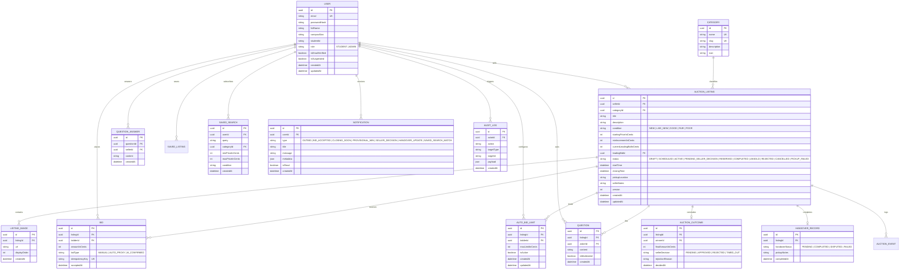

# Database Architecture & Entity-Relationship Documentation

## Entity-Relationship Diagram

```mermaid
erDiagram
    USER ||--o{ AUCTION_LISTING : sells
    USER ||--o{ BID : places
    USER ||--o{ AUTO_BID_LIMIT : configures
    USER ||--o{ QUESTION : asks
    USER ||--o{ QUESTION_ANSWER : answers
    USER ||--o{ SAVED_LISTING : saves
    USER ||--o{ SAVED_SEARCH : subscribes
    USER ||--o{ NOTIFICATION : receives
    USER ||--o{ AUDIT_LOG : triggers

    CATEGORY ||--o{ AUCTION_LISTING : classifies

    AUCTION_LISTING ||--o{ LISTING_IMAGE : contains
    AUCTION_LISTING ||--o{ BID : receives
    AUCTION_LISTING ||--o{ AUTO_BID_LIMIT : binds
    AUCTION_LISTING ||--o{ QUESTION : has
    AUCTION_LISTING ||--o| AUCTION_OUTCOME : concludes
    AUCTION_LISTING ||--o| HANDOVER_RECORD : completes
    AUCTION_LISTING ||--o{ AUCTION_EVENT : logs

    USER {
        uuid id PK
        string email UK
        string passwordHash
        string fullName
        string campusAlias
        string studentId
        string role "STUDENT | ADMIN"
        boolean isEmailVerified
        boolean isSuspended
        datetime createdAt
        datetime updatedAt
    }

    CATEGORY {
        uuid id PK
        string name UK
        string slug UK
        string description
        string icon
    }

    AUCTION_LISTING {
        uuid id PK
        uuid sellerId FK
        uuid categoryId FK
        string title
        string description
        string condition "NEW | LIKE_NEW | GOOD | FAIR | POOR"
        int startingPriceInCents
        int minIncrementInCents
        int currentLeadingBidInCents
        uuid leadingBidId FK
        string status "DRAFT | SCHEDULED | ACTIVE | PENDING_SELLER_DECISION | RESERVED | COMPLETED | UNSOLD | REJECTED | CANCELLED | PICKUP_FAILED"
        datetime startTime
        datetime closingTime
        string pickupLocation
        string sellerNotes
        int version
        datetime createdAt
        datetime updatedAt
    }

    LISTING_IMAGE {
        uuid id PK
        uuid listingId FK
        string url
        int displayOrder
        datetime createdAt
    }

    BID {
        uuid id PK
        uuid listingId FK
        uuid bidderId FK
        int amountInCents
        string bidType "MANUAL | AUTO_PROXY | AI_CONFIRMED"
        string idempotencyKey UK
        datetime acceptedAt
    }

    AUTO_BID_LIMIT {
        uuid id PK
        uuid listingId FK
        uuid bidderId FK
        int maxLimitInCents
        boolean isActive
        datetime createdAt
        datetime updatedAt
    }

    AUCTION_OUTCOME {
        uuid id PK
        uuid listingId FK
        uuid winnerId FK
        int finalAmountInCents
        string sellerDecision "PENDING | APPROVED | REJECTED | TIMED_OUT"
        string rejectionReason
        datetime decidedAt
    }

    HANDOVER_RECORD {
        uuid id PK
        uuid listingId FK
        string handoverStatus "PENDING | COMPLETED | DISPUTED | FAILED"
        string pickupNotes
        datetime completedAt
    }

    QUESTION {
        uuid id PK
        uuid listingId FK
        uuid askerId FK
        string content
        boolean isModerated
        datetime createdAt
    }

    QUESTION_ANSWER {
        uuid id PK
        uuid questionId FK
        uuid sellerId FK
        string content
        datetime createdAt
    }

    SAVED_SEARCH {
        uuid id PK
        uuid userId FK
        string query
        uuid categoryId FK
        int minPriceInCents
        int maxPriceInCents
        string condition
        datetime createdAt
    }

    NOTIFICATION {
        uuid id PK
        uuid userId FK
        string type "OUTBID | BID_ACCEPTED | CLOSING_SOON | PROVISIONAL_WIN | SELLER_DECISION | HANDOVER_UPDATE | SAVED_SEARCH_MATCH"
        string title
        string message
        json metadata
        boolean isRead
        datetime createdAt
    }

    AUDIT_LOG {
        uuid id PK
        uuid actorId FK
        string action
        string targetType
        string targetId
        json payload
        datetime createdAt
    }
```
